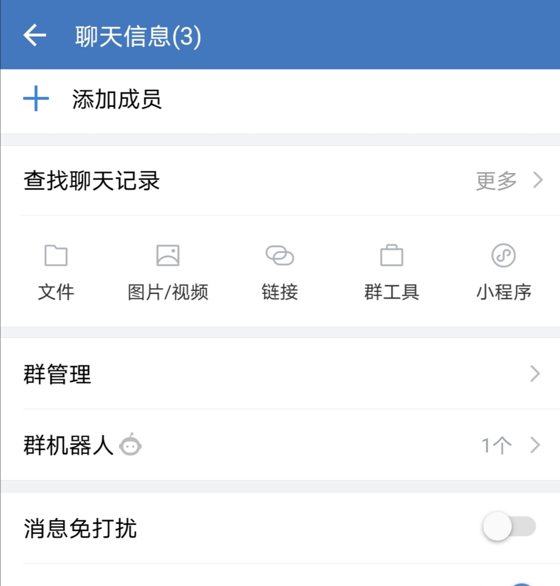
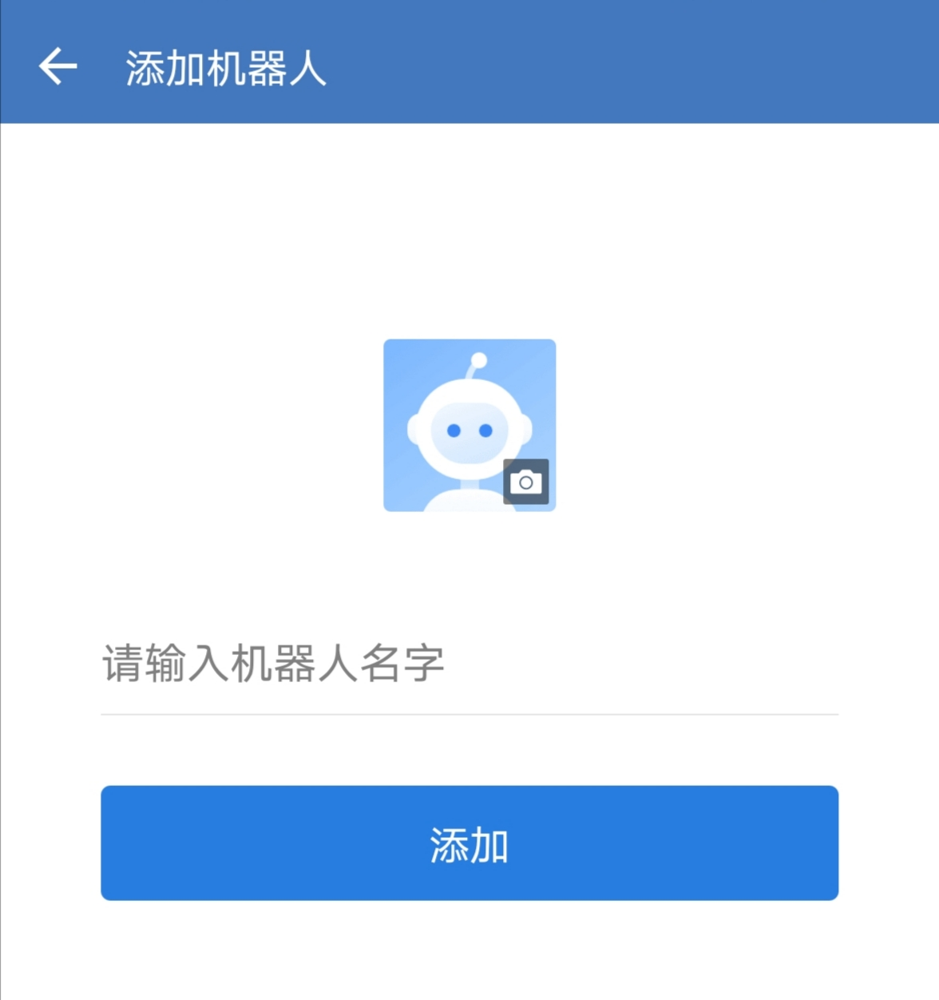
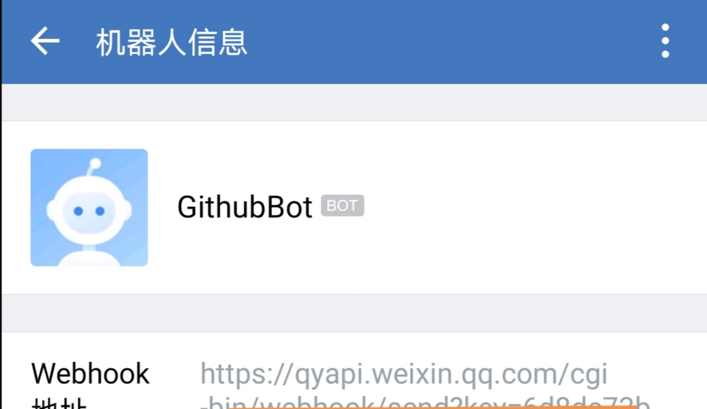
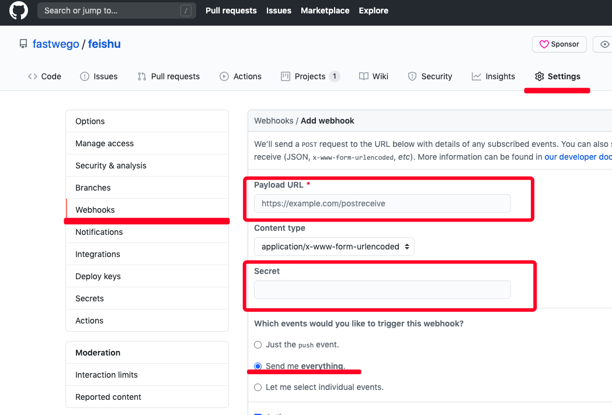
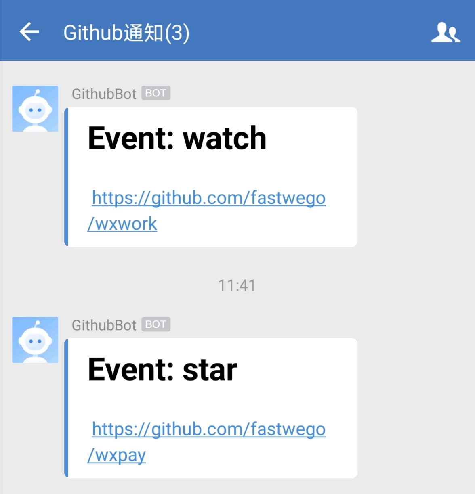

# 如何用 5 分钟在企业微信上打造一个 Github 机器人

## 需求

当 github 发生 push / pull request / issue / release 等事件的时候，同步通知到企业微信内部群

## 技术原理

- Github 提供了 webhook 配置，当订阅事件发生后，会向配置的 url 发送请求，告知具体事件
- 企业微信内部群提供了添加机器人的功能，调用机器人发送消息接口就可以发送消息到企业内部群

所以，我们只需开发一个服务，接收 Github 通知，根据事件类型调用企业微信机器人接口，向内部群发送消息即可
## 配置企业微信内部群机器人

- 进入群设置页面，可以看到机器人配置入口


- 添加一个机器人


- 获取机器人的 webhook 地址




## 配置 github



- 填写通知地址(例如 https://fastwego.dev/api/github/webhook)
- 设置 secret

## 开发机器人

### 配置

- 将Github Secret 和 企业微信机器人 webhook url 配置更新到 `.env` 文件：
```.env
SECRET=xxxx
WEBHOOK_URL=xxx
LISTEN=:80
```

- 编写代码：

```go
package main

import (
	"bytes"
	"crypto/hmac"
	"crypto/sha1"
	"encoding/hex"
	"encoding/json"
	"fmt"
	"github.com/spf13/viper"
	"io/ioutil"
	"net/http"
)

func init() {
	// 加载配置文件
	viper.SetConfigFile(".env")
	_ = viper.ReadInConfig()
}

func main() {

	http.HandleFunc("/api/github/webhook", func(w http.ResponseWriter, r *http.Request) {

		payload, err := ioutil.ReadAll(r.Body)

		fmt.Println(string(payload))

		if err != nil || len(payload) == 0 {
			return
		}

		event := r.Header.Get("X-GitHub-Event")
		if event == "" {
			return
		}

		secret := viper.GetString("SECRET")
		if len(secret) > 0 {
			signature := r.Header.Get("X-Hub-Signature")
			if len(signature) == 0 {
				return
			}
			mac := hmac.New(sha1.New, []byte(secret))
			_, _ = mac.Write(payload)
			expectedMAC := hex.EncodeToString(mac.Sum(nil))

			if !hmac.Equal([]byte(signature[5:]), []byte(expectedMAC)) {
				return
			}
		}

		e := struct {
			Repository struct {
				FullName string `json:"full_name"`
			} `json:"repository"`
		}{}

		var repo string

		err = json.Unmarshal(payload, &e)
		if err != nil {
			repo = "unknown"
		}

		repo = e.Repository.FullName

		notify := struct {
			Msgtype string `json:"msgtype"`
			Markdown    struct {
				Content string `json:"content"`
			} `json:"markdown"`
		}{}

		notify.Msgtype = "markdown"
		notify.Markdown.Content = fmt.Sprintf("## Event: %s \n https://github.com/%s", event, repo)

		fmt.Println(notify)

		payload, err = json.Marshal(notify)
		response, err := http.Post(viper.GetString("WEBHOOK_URL"), "application/json", bytes.NewReader(payload))
		if err != nil {
			fmt.Println(err)
			return
		}

		all, err := ioutil.ReadAll(response.Body)
		fmt.Println(string(all), err)

	})

	_ = http.ListenAndServe(viper.GetString("LISTEN"), nil)
}

```

## 编译 & 部署 到服务器

`GOOS=linux go build`

`chmod +x ./github-webhook-bot && ./github-webhook-bot`

## 最终发送消息效果



## 结语

恭喜你！5分钟内就完成了一款Github机器人开发

完整演示代码：[https://github.com/fastwego/wxwork-demo](https://github.com/fastwego/wxwork-demo)