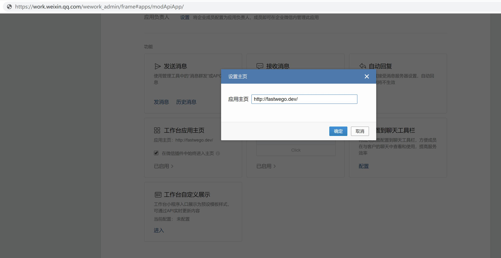
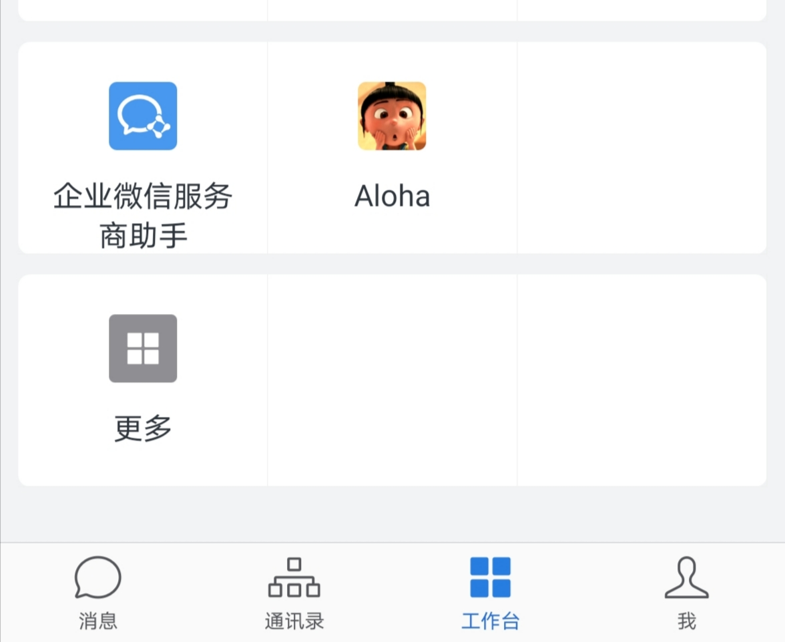
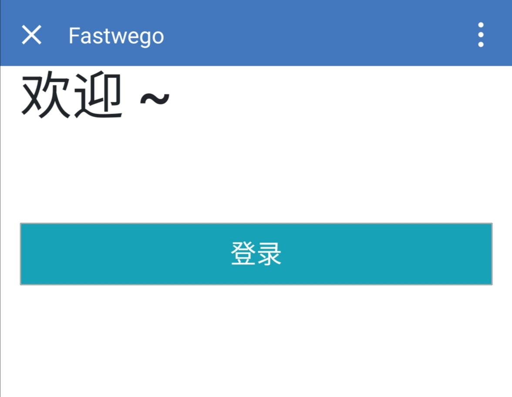
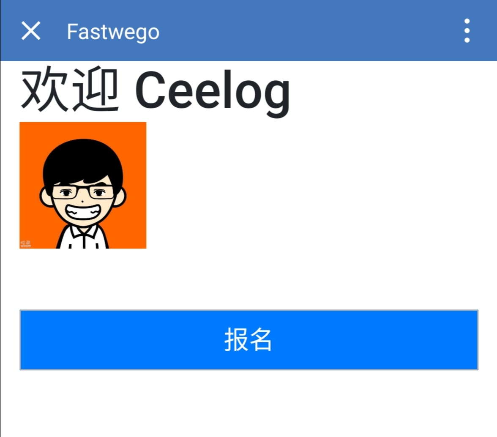

# 如何用 5 分钟在企业微信上搭建一款活动报名 App 

## 需求

公司内部活动报名，需要员工登录 & 发送报名通知

## 技术原理

企业微信提供了 获取 员工信息 接口 和 发送消息 接口

所以，我们只需开发一个服务，员工完成登录后 记录session，报名成功后 发送消息 即可

## 配置企业微信内部应用

- 设置工作台应用主页


- 可以在企业微信工作台看到入口


- 点击进入主页


- 点击登录 可以获取员工信息


- 点击报名后，可以收到通知


## 主要代码：

```go

var Corp *corporation.Corporation
var App *corporation.App

func init() {
	// 加载配置文件
	viper.SetConfigFile(".env")
	_ = viper.ReadInConfig()

	Corp = corporation.New(corporation.Config{
		Corpid: viper.GetString("CorpId"),
	})

	App = Corp.NewApp(corporation.AppConfig{
		AgentId: viper.GetString("AgentId"),
		Secret:  viper.GetString("Secret"),
	})

	fmt.Println(Corp, App)
}

func main() {

	router := gin.New()
	router.Use(gin.Logger(), gin.Recovery())

	// Session
	store := cookie.NewStore([]byte("secret"))
	router.Use(sessions.Sessions("gosession", store))

	router.GET("/", Index)
	router.GET("/login", Login)

	svr := &http.Server{
		Addr:    viper.GetString("LISTEN"),
		Handler: router,
	}

	go func() {
		err := svr.ListenAndServe()
		if err != nil && err != http.ErrServerClosed {
			log.Fatalln(err)
		}
	}()

	quit := make(chan os.Signal)
	signal.Notify(quit, syscall.SIGINT, syscall.SIGTERM)
	<-quit

	timeout := time.Duration(5) * time.Second
	ctx, cancel := context.WithTimeout(context.Background(), timeout)
	defer cancel()

	if err := svr.Shutdown(ctx); err != nil {
		log.Fatalln(err)
	}
}

type User struct {
	Userid  string `json:"userid"`
	Name    string `json:"name"`
	Avatar  string `json:"avatar"`
	Message string `json:"message"`
}

func Index(c *gin.Context) {

	session := sessions.Default(c)
	user := session.Get("user")

	loginUser, ok := user.(User)
	if !ok {
		loginUser = User{}
	}

	join := c.Query("join")
	if len(join) > 0 {
		// 发送 报名信息
		type Textcard struct {
			Title       string `json:"title"`
			Description string `json:"description"`
			URL         string `json:"url"`
			Btntxt      string `json:"btntxt"`
		}

		textCard := struct {
			Touser                 string   `json:"touser"`
			Toparty                string   `json:"toparty"`
			Totag                  string   `json:"totag"`
			Msgtype                string   `json:"msgtype"`
			Agentid                string   `json:"agentid"`
			Textcard               Textcard `json:"textcard"`
			EnableIDTrans          int      `json:"enable_id_trans"`
			EnableDuplicateCheck   int      `json:"enable_duplicate_check"`
			DuplicateCheckInterval int      `json:"duplicate_check_interval"`
		}{
			Touser:  loginUser.Userid,
			Msgtype: "textcard",
			Agentid: App.Config.AgentId,
		}

		textCard.Textcard = Textcard{Title: "报名成功", Description: "请来我办公室 <br> <div class='highlight'>记得带上吃饭的家伙 ~</div>", URL: viper.GetString("ServerUrl"), Btntxt: "好的"}

		payload, err := json.Marshal(textCard)
		fmt.Println(string(payload), err)
		if err != nil {
			return
		}

		resp, err := message.Send(App, payload)
		fmt.Println(string(resp), err)

		loginUser.Message = "报名成功~"
	}

	t1, err := template.ParseFiles("index.html")
	if err != nil {
		fmt.Println(err)
		return
	}

	t1.Execute(c.Writer, loginUser)
}

func Login(c *gin.Context) {

	code := c.Query("code")

	// 跳转登录
	if len(code) == 0 {
		var redirectUri = viper.GetString("ServerUrl") + "/login"
		link := oauth.GetAuthorizeUrl(viper.GetString("CorpId"), redirectUri, "STATE")
		c.Redirect(302, link)
		return
	}

	// 获取用户身份
	accessToken, err := App.AccessToken.GetAccessTokenHandler(App)
	userInfo, err := oauth.GetUserInfo(accessToken, code)
	fmt.Println(userInfo, err)
	if err != nil {
		return
	}

	// 获取员工详细信息
	params := url.Values{}
	params.Add("userid", userInfo.UserID)
	resp, err := contact.UserGet(App, params)
	fmt.Println(string(resp), err)
	if err != nil {
		return
	}

	user := User{}

	err = json.Unmarshal(resp, &user)
	if err != nil {
		fmt.Println(err)
		return
	}

	// 记录 Session
	gob.Register(User{})
	session := sessions.Default(c)
	session.Set("user", user)
	fmt.Println(user)
	err = session.Save()

	if err != nil {
		fmt.Println(err)
		return
	}

	// 返回首页
	c.Header("Content-Type", "text/html")
	_, _ = c.Writer.WriteString(`<html"><head><meta http-equiv="refresh" content="0;URL='/'" /></head><body></body></html>`)
}

```


## 结语

恭喜你！5分钟内就完成了一款企业内部 App 开发

完整演示代码：[https://github.com/fastwego/wxwork-demo](https://github.com/fastwego/wxwork-demo)